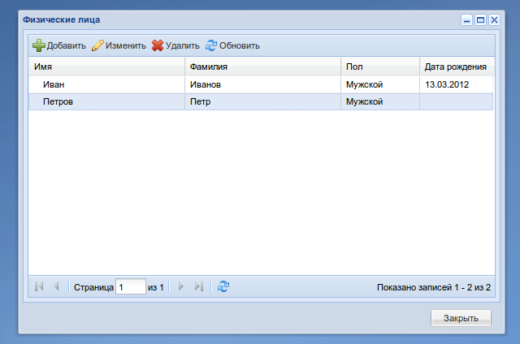
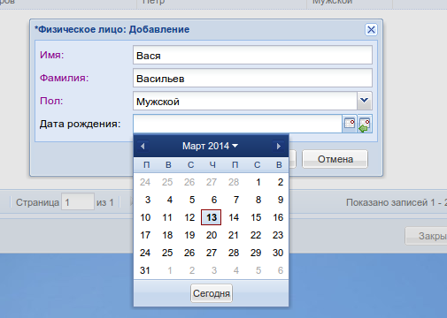

.. objectpack documentation master file, created by
   sphinx-quickstart on Mon Jul 30 13:48:27 2012.
   You can adapt this file completely to your liking, but it should at least
   contain the root `toctree` directive.

.. include:: global.rst

objectpack: Батарейки для m3
****************************

.. toctree::
   :maxdepth: 3

   tutorial
   api_reference

Быстрый старт
=============

objectpack расширяет возможности m3-core и m3-ext и позволяет экстремально
быстро разрабатывать справочники для различных учётных систем.

Например, простой справочник физических лиц:

.. code::

    # models.py

    class Person(models.Model):

        GENDERS = (
            (0, u''),
            (1, u'Мужской'),
            (2, u'Женский'),
        )

        name = models.CharField(max_length=150, verbose_name=u'Имя')
        surname = models.CharField(max_length=150, verbose_name=u'Фамилия')
        gender = models.PositiveSmallIntegerField(
            choices=GENDERS,
            default=GENDERS[0][0],
            verbose_name=u'Пол')
        birthday = models.DateField(
            null=True, blank=True,
            verbose_name=u'Дата рождения')

        def __unicode__(self):
            return u"%s %s" % (self.surname, self.name)

        class Meta:
            verbose_name = u'Физическое лицо'
            verbose_name_plural = u'Физические лица'

.. code::

    # actions.py

    class PersonPack(objectpack.ObjectPack):

        model = models.Person

        add_window = edit_window = objectpack.ModelEditWindow.fabricate(model)

        add_to_menu = True

        columns = [
            {
                'data_index': 'name',
                'header': u'Имя',
                'width': 2,
            },
            {
                'data_index': 'surname',
                'header': u'Фамилия',
                'width': 2,
            },
            {
                'data_index': 'gender',
                'header': u'Пол',
                'width': 1,
            },
            {
                'data_index': 'birthday',
                'header': u'Дата рождения',
                'width': 1,
            }
        ]

Что мы получим в результате:

    Окно со списком объектов

    Окно добавления/редактирования объекта

