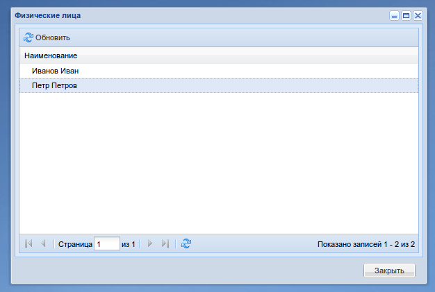
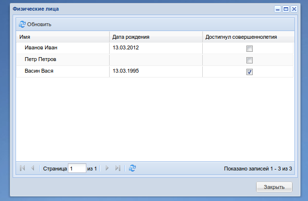
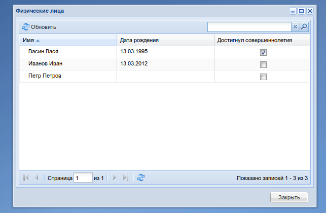
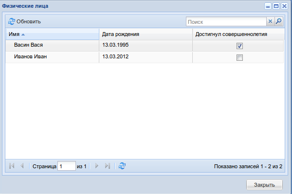
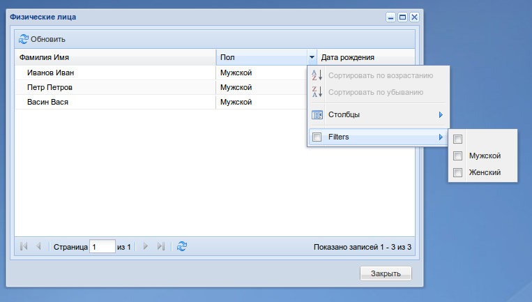
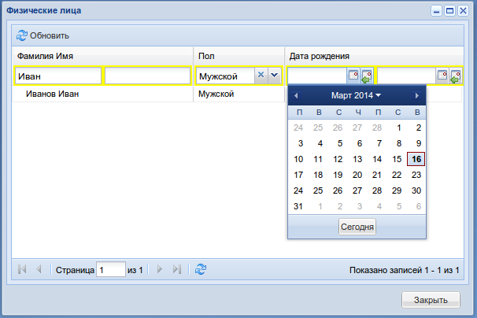
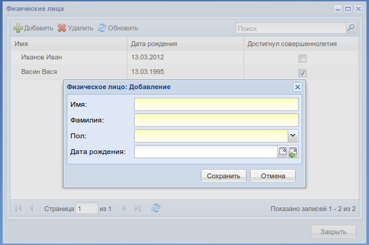
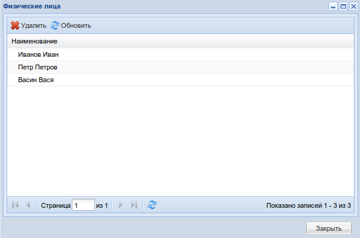

.. include:: global.rst

Установка и настройка окружения
===============================

1. Установить зависимости::

    pip install m3-core m3-ext3 objectpack django==1.4

2. Если django-проект ещe не создан, то создаем и в ``INSTALLED_APS``
   добавляем приложения::

    INSTALLED_APPS = (
        
        ...
        'm3_ext',
        'm3_ext.ui',
        'objectpack',
    )	

3. #TODO: Подключить desktop view (м.б. сделать ссылку на m3-ext3)

4. Инициализировать контроллер::

    # controller.py
    from objectpack.observer import ObservableController, Observer

    observer = Observer()
    controller = ObservableController(url="actions", observer=observer)

5. #TODO: Расширить urlpatterns

6. PROFIT!

Подробно про ObjectPack
=======================

|ObjectPack| - это пак, который реализует основные
CRUD операции для модели и содержит следующие экшены:

* |ObjectListWindowAction| - возвращает окно со списком объектов
* |ObjectRowsAction| - возвращает JSON-строки для окна со списком объектов
* |ObjectAddWindowAction| - возвращает ExtJS окно добавления нового объекта
* |ObjectEditWindowAction| - возвращает ExtJS окно редактирования объекта
* |ObjectSaveAction| - сохранение нового и обновление существующего объектов
* |ObjectDeleteAction| - удаляет объекты

Для того чтобы сконфигурировать свой пак, минимально требуется лишь указать
модель, по которой он будет строиться. Так предыдущий пример можно было
записать как::

    # actions.py

    class PersonPack(ObjectPack):

        model = Person

        # разрешим добавлять ссылку на list_window в меню Desktop'а
        add_to_menu = True

.. _list_window:

    List Window - Окно со списком объектов

Всё по прежнему работает, но вместо колонок с полями модели в гриде отображается
всего одна колонка "Наименование" и пропали кнопки Добавить/Редактировать/Удалить.
Так мы получили простой список объектов.

Список объектов
---------------

Настройки колонок в окне со списком объектов хранятся в атрибуте :attr:`columns`.
По умолчанию он имеет значение::

    columns = [
        {
            'data_index': '__unicode__',
            'header': u'Наименование',
        }
    ]

:attr:`columns` - это список словарей, где каждый словарь соответствует одной
колонке. Колонки в гриде будут расположены в том же порядке.

data_index
++++++++++

Для задания колонки достаточно задать ключ `data_index`, значением которого
могут быть атрибут объекта, property или callable объект, который
можно вызвать без передачи аргументов. Так же можно получить доступ к атрибутам
доступным через композицию, например ``'userprofile.user.username'``.

prepare_row
+++++++++++

Можно указать значение несуществующего атрибута. В |ObjectPack| есть метод
:func:`prepare_row <objectpack.actions.ObjectPack.prepare_row>`, который
позвоялет установить дополнительные атрибуты в объект перед сериализацией в
JSON::

    # actions.py

    class PersonPack(ObjectPack):

        model = Person

        columns = [
            {
                'data_index': '__unicode__',
                'header': u'Имя',
            },
            {
                'data_index': 'birthday',
                'header': u'Дата рождения',
            },
            {
                'data_index': 'is_adult',
                'header': u'Достигнул совершеннолетия',
            }
        ]

        def prepare_row(self, obj, request, context):
            today = datetime.date.today()
            is_adult = ((today - obj.birthday).days // 365 >= 18)
            obj.is_adult = '
' % (
                '-on' if is_adult else '')
            return obj

    Физ. лица, достигнувшие совершеннолетия

Сортировка и поиск
++++++++++++++++++

Чтобы включить поиск и сортировку по колонке, нужно добавить в :attr:`columns`::

    columns = [

        {
            'data_index': '__unicode__',
            'header': u'Имя',
            'searchable': True,
            'search_fields': ('name', 'surname'),
            'sortable': True,
            # Сортировка сперва по имени, потом по фамилии
            'sort_fields': ('name', 'surname'),
        }

    ]

    Поиск и сортировка

Значениями по ключам ``search_fields`` и ``sort_fields`` должнен быть кортеж из
лукапов полей django модели. Например::

    {
        'search_fields': (
            'userprofile__user__username',
            'userprofile__person__name',
            'userprofile__person__surname')
    }

.. note::
    Если ``data_index`` колонки соотвествует полям модели, то ключи
    ``search_fields`` и ``sort_fields`` можно опустить.

Установкой атрибута :attr:`list_sort_order` можно задать сортировку по умолчанию::

    class PersonPack(ObjectPack):

        list_sort_order = ('name', 'surname')

Фильтрация на сервере
+++++++++++++++++++++

Часто бывает необходимо ограничить изначальную выборку данных.
Для этого необходимо в паке перегрузить метод
:func:`get_rows_query <objectpack.actions.ObjectPack.get_rows_query>`::

    def get_rows_query(self, request, context):
        query = super(PersonPack, self).get_rows_query(request, context)
        query = query.filter(birthday__isnull=False)
        return query

    Только физ. лица с указанной датой рождения

Колоночные фильтры
++++++++++++++++++

Иногда общей строки поиска по гриду бывает недостаточно и нужны отдельные фильтры
по колонкам. В objectpack есть два вида колоночных фильтров: встроенные в контекстное
меню заголовка колонки и контролы расположенные непросредтвенно в заголовке. По умолчанию
включен первый тип. Рассмотрим на примере::

    class PersonPack(ObjectPack):

        model = Person

        columns = [
            {
                'data_index': '__unicode__',
                'header': u'Фамилия Имя',
                'width': 2,
                'filter': {
                    'type': 'string',
                    'custom_fields': ('name', 'surname')
                }
            },
            {
                'data_index': 'gender',
                'header': u'Пол',
                'width': 1,
                'filter': {
                    'type': 'list',
                    'options': model.GENDERS
                }
            },
            {
                'data_index': 'birthday',
                'header': u'Дата рождения',
                'width': 1,
                'filter': {
                    'type': 'date',
                }
            }
        ]

    Фильтр, встроенный в контекстное меню

.. code::

    from functools import partial
    from objectpack.filters import ColumnFilterEngine, FilterByField

    class PersonPack(objectpack.ObjectPack):

        model = models.Person

        filter_engine_clz = ColumnFilterEngine

        f = partial(FilterByField, model)

        columns = [
            {
                'data_index': '__unicode__',
                'header': u'Фамилия Имя',
                'width': 2,
                'filter': (
                    f('name', 'name__icontains')
                    & f('surname', 'surname__icontains')
                )
            },
            {
                'data_index': 'gender',
                'header': u'Пол',
                'width': 1,
                'filter': f('gender')
            },
            {
                'data_index': 'birthday',
                'header': u'Дата рождения',
                'width': 2,
                'filter': (
                    f('birthday', 'birthday__gte', tooltip=u'С')
                    & f('birtday', 'birthday__lte', tooltip=u'По')
                )
            }
        ]

    Колоночный фильтр

Окно со списком объектов
++++++++++++++++++++++++

По умолчанию в качестве окна со списком объектов используется
:class:`BaseListWindow <objectpack.ui.BaseListWindow>`. Отнаследовавшись от него
можно конфигурировать свои окна со списками или можно перегрузить методы пака
:func:`create_list_window <objectpack.actions.ObjectPack.create_list_window>`
и :func:`get_list_window_params <objectpack.actions.ObjectPack.get_list_window_params>`.

Создание объекта
----------------

Теперь добавим в наш справочник возможность создавать новые объекты.

Окно добавления
+++++++++++++++

Для этого необходимо установить в атрибут :attr:`add_window` класс окна.
Это может быть любой класс, унаследованный от
:class:`BaseEditWindow <objectpack.ui.BaseEditWindow>`.

Этот класс реализует каркас для окна и предоставляет некоторый интерфейс,
который следует соблюдать::

    from objectpack.ui import BaseEditWindow, make_combo_box
    from m3_ext.ui import all_components as ext

    from models import Person

    class PersonAddWindow(BaseEditWindow):

        def _init_components(self):
            """
            Здесь следует инициализировать компоненты окна и складывать их в
            :attr:`self`.
            """
            super(PersonAddWindow, self)._init_components()

            self.field__name = ext.ExtStringField(
                label=u'Имя',
                name='name',
                allow_blank=False,
                anchor='100%')

            self.field__surname = ext.ExtStringField(
                label=u'Фамилия',
                name='surname',
                allow_blank=False,
                anchor='100%')

            self.field__gender = make_combo_box(
                label=u'Пол',
                name='gender',
                allow_blank=False,
                anchor='100%',
                data=Person.GENDERS)

            self.field__birthday = ext.ExtDateField(
                label=u'Дата рождения',
                name='birthday',
                anchor='100%')

        def _do_layout(self):
            """
            Здесь размещаем компоненты в окне
            """
            super(PersonAddWindow, self)._do_layout()
            self.form.items.extend((
                self.field__name,
                self.field__surname,
                self.field__gender,
                self.field__birthday,
            ))

        def set_params(self, params):
            """
            Установка параметров окна

            :params: Словарь с параметрами, передается из пака
            """
            super(PersonAddWindow, self).set_params(params)
            self.height = 'auto'

Теперь скажем паку какое окно нужно использовать::

    class PersonPack(ObjectPack):

        model = Person

        add_window = ui.PersonAddWindow

        ...

    Окно создания физ. лица

Генерация окон
++++++++++++++

Описание компонент окна занятие утомительное и скучное. К счастью в objectpack
есть убер-фича - генерация окон редактирования для модели. Так окно из
предыдущего примера полностью идентично слудующему::

    from objectpack import ModelEditWindow

    add_window = ModelEditWindow.fabricate(model=Person)

.. _create_edit_window:

Тонкая настройка окон
+++++++++++++++++++++

Часто бывает нужно дополнительно сконфигурировать окно, особенно это актуально
в случае с генерированными окнами. Для этого удобно использовать два метода в
паке: :func:`create_edit_window <objectpack.actions.ObjectPack.create_edit_window>`
и :func:`get_edit_window_params <objectpack.actions.ObjectPack.get_edit_window_params>`

Редактирование
--------------

Теперь добавим возможность редактировать объекты. Для этого нужно паку задать
атрибут :attr:`edit_window`. В нашем случае окно редактирования идентично окну
создания, поэтому мы пишем::

    add_window = edit_window = ModelEditWindow.fabricate(model=Person)

Окно редактирирование может быть сложным, например, когда у модели есть зависимые
модели. В таких случаях можно использовать окно с вкладками
:class:`TabbedWindow <objectpack.ui.TabbedWindow>`.

Конфигурирование окна осуществляется `так же <create_edit_window_>`_ как
и для окна создания.

Сохранение
----------

|ObjectSaveAction| будет доступен в паке после задания либо окна создания,
либо окна редактирования объекта.

При сохранении значения из формы окна добавления/редактирования сопоставляются
с полями модели по атрибутам :attr:`name` элементов формы.

Непосредственное сохранение объекта модели происходит в методе
:func:`save_row <objectpack.actions.ObjectPack.save_row>`. Перегрузив этот метод
можно дополнительно управлять сохранением объекта::

    def save_row(self, obj, create_new, request, context):
        if not (obj.name.isalpha() and obj.surname.isalpha()):
            raise ApplicationLogicException(
                u'Имя и Фамилимя могут содержать только буквы алфавита!')
        super(PersonPack, self).save_row(obj, create_new, request, context)

Удаление
--------

За удаление объекта отвечает атрибут :attr:`can_delete`, который может принимать
три значения: ``True``, ``False`` или ``None``. По умолчанию ``None``.

Если установлено значение ``None``, то |ObjectDeleteAction| будет добавлен в пак
если задано либо окно добавления, либо окно редактирования. ``True`` удаление
возможно и ``False`` - не возможно::

    class PersonPack(ObjectPack):

        model = Person

        can_delete = True

    Простой список с можностью удаления

Само удаление объекта модели происходит в методе
:func:`delete_row <objectpack.actions.ObjectPack.delete_row>`. По умолчанию тут
вызывается метод :attr:`safe_delete` модели и, если он не определен, вызывается
функция :func:`m3.db.safe_delete`. Перегрузив его можно управлять удалением
объекта::

    def delete_row(self, obj_id, request, context):
        if date.today().weekday() in (5, 6):
            raise ApplicationLogicException(
                u'Нельзя удалять записи в выходные дни!')

        # не хотим использовать m3.db.safe_delete
        obj = self.model.objects.get(id=obj_id)
        obj.delete()
        return obj

Контроллер, наблюдатель и точки расширения
==========================================

В качестве контроллера в ObjectPack используется |ObservableController|.
Особенностью этого контроллера является то, что при регистрации в нём экшена,
последний в свою очередь добавляется в реестр слушателей наблюдателя |Observer|.

Observer
--------

|Observer| позволяет регистрировать в экшенах точки расширения,
а также добавляет в каждый экшен две точки расширения *before* и *after*, которые
действуют как :mod:`m3.actions.Action.pre_run` и :mod:`m3.actions.Action.post_run`,
но выполняются соответственно до и после них, т.е. если методы *before* и *after*
вернут какой-либо результат ActionResult, то результатом выполнения экшена будет он.

Рассмотрим на примере из :mod:`objectpack.demo`::

    # создаём наблюдателя
    obs = observer.Observer()
        #logger=logger, verbose_level=observer.Observer.LOG_MORE)

    # создаём контроллер
    action_controller = observer.ObservableController(obs, "/controller")

Далее создаем слушателя, который описывается классом с одним обязательным атрибутом `listen`::

    @obs.subscribe
    class Listener(object):

        # список регулярок, для сопоставления экшенам
        listen = ['.*/.*/ObjectListWindowAction']

        def after(self, request, context, response):
            response.data.title = u'Му-ха-ха! %s' % response.data.title

Так мы подменили текст заголовка окна, метод *after* слушателя будет вызван после post_run экшена.

.. note::
    response - это по сути ActionResult, а мы помним что,
    ExtUIScriptResult в атрибуте data хранит ExtJS компонент, в данном
    случае это будет объект окна :mod:`objectpack.ui.BaseListWindow`.

Помимо *before* и *after* в экшенах ObjectPack'a, зарегистрировано множество полезных точек расширения,
например *prepare_obj* для :mod:`objectpack.actions.ObjectRowsAction`, которая делает тоже что и
:mod:`objectpack.actions.ObjectPack.prepare_row`, только *request* и *context* здесь будут аттрибутами слушателя::

    @obs.subscribe
    class StarToHash(object):

        listen = ['.*/BandedColumnPack/.*']

        def prepare_obj(self, obj):
            obj['field1'] = obj.get('field1', False) and (obj['id'] % 2)
            return obj

:ref:`Ниже <extension_points>` приведен полный перечень точек расширения для ObjectPack, но ничего не мешает нам
зарегистрировать свои::

    class DoSomethingAction(objectpack.BaseAction):

        def run(self, request, context):
            message = 'Done'
            self.handle('do_well', message)
            return OperationResult(message=message)

    @obs.subscribe
    class DoSomethingListener(object):

        listen = ['.*/.*/DoSomethingAction']

        def do_well(self, message):
            message = 'Well Done!'
            return message

Результатом выполнения этого экшена будет информационное окошко с текстом *Well Done!*

.. note::
    Если слушатели пишутся в одном приложении рядом с экшенами, то проще подключать их
    через декоратор. В случае если слушателей нужно подключить в другом модуле или в
    другом приложении, то лучше вынести их в отдельный модуль listeners.py и выполнить
    их регистрацию в `app_meta.register_action`. Регистировать можно либо через импорт модуля,
    если вы используете декоратор, или вызовом функции, которая будет подписывать слушателей в
    Observer

Когда могут понадобиться точки расширения?
------------------------------------------

Через точки расширения удобно делать проверки прав доступа и различных условий
бизнес логики, тем самым можно разгрузить код экшена и делегировать эти
проверки слушателю. Так же через точки расширения можно реализовать
механизм плагинов.

.. _extension_points:

Доступные точки расширения
--------------------------

+----------------------+----------------------+-----------------------------+----------------------------------------+
+Action                +Точка расширения      +Тип передаваемого объекта    +Описание                                +
+======================+======================+=============================+========================================+
+|ObjectRowsAction|    +query                 +Выборка данных QuerySet      +Манипуляции с выборкой данных из БД     +
+                      +----------------------+-----------------------------+----------------------------------------+
+                      +*Следующие три точки технически ничем не отличается от query, но были вынесены отдельно,     +
+                      +чтобы не нарушать семантику*                                                                 +
+                      +----------------------+-----------------------------+----------------------------------------+
+                      +apply_search          +Выборка данных QuerySet      +Поиск по выборке                        +
+                      +----------------------+-----------------------------+----------------------------------------+
+                      +apply_filter          +Выборка данных QuerySet      +Фильтрация выборки                      +
+                      +----------------------+-----------------------------+----------------------------------------+
+                      +apply_sort_order      +Выборка данных QuerySet      +Сортировка выборки                      +
+                      +----------------------+-----------------------------+----------------------------------------+
+                      +get_rows              +Список строк для сериализации+Манипуляция с готовым с сериалиазации   +
+                      +                      +в JSON                       +списком                                 +
+                      +----------------------+-----------------------------+----------------------------------------+
+                      +prepare_obj           +Объект модели                +Манипуляции с объектом перед            +
+                      +                      +                             +сериализацией в JSON (например,         +
+                      +                      +                             +установка доподнительных атрибутов)     +
+                      +----------------------+-----------------------------+----------------------------------------+
+                      +row_editing           +Кортеж с результатом         +Обработка редактирования ячейки         +
+                      +                      +редактирования ячейки:       +                                        +
+                      +                      +(Успешно/Неуспешно, Текст    +                                        +
+                      +                      +ошибки/None)                 +                                        +
+----------------------+----------------------+-----------------------------+----------------------------------------+
+|ObjectDeleteAction|  +TODO: пока нет                                                                               +
+----------------------+----------------------+-----------------------------+----------------------------------------+
+|ObjectSaveAction|    +save_obj              +Объект модели                +Обработка сохранения модели. Слушатель  +
+                      +                      +                             +должен возбуждать исключение            +
+                      +                      +                             +|AlreadySaved|, если объект уже успешно +
+                      +                      +                             +сохранён                                +
+----------------------+----------------------+-----------------------------+----------------------------------------+
+|ObjectEditWindow\    +set_window_params     +Словарь с параметрами для    +Манипуляции со словарём параметров для  +
+Action|               +                      +передачи в окно              +окна редактирования/добавления          +
+|ObjectAddWindow\     +                      +                             +                                        +
+Action|               +                      +                             +                                        +
+                      +----------------------+-----------------------------+----------------------------------------+
+                      +create_window         +Объект окна (потомок         +Манипуляции с компонентом окна (        +
+                      +                      +|BaseWindow|)                +добавление/удаление/редактирование      +
+                      +                      +                             +различных элементов, установка          +
+                      +                      +                             +параметров и т.д и т.п.                 +
+----------------------+----------------------+-----------------------------+----------------------------------------+
+|ObjectListWindow\    +TODO: пока нет                                                                               +
+Action|               +                                                                                             +
+----------------------+----------------------+-----------------------------+----------------------------------------+
+Все экшены            +before                +Принимает в аргументах       +Выполняется перед pre_run экшена        +
+                      +                      +request, context             +                                        +
+                      +----------------------+-----------------------------+----------------------------------------+
+                      +after                 +Принимает в аргументах       +Выполняется после post_run экшена       +
+                      +                      +request, context и result    +                                        +
+----------------------+----------------------+-----------------------------+----------------------------------------+
